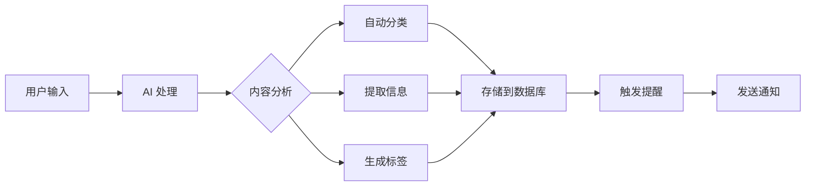

# CogniFlow

<div align="center">


# 🚀 AI 驱动的智能信息管理平台

**让 AI 接管信息杂务，让你专注真正重要的事**

[](https://opensource.org/licenses/MIT)
[](https://nodejs.org)
[](https://react.dev)
[](https://www.typescriptlang.org)
[](https://www.postgresql.org)
[![zread](https://img.shields.io/badge/Ask_Zread-_.svg?style=flat&color=00b0aa&labelColor=000000&logo=data%3Aimage%2Fsvg%2Bxml%3Bbase64%2CPHN2ZyB3aWR0aD0iMTYiIGhlaWdodD0iMTYiIHZpZXdCb3g9IjAgMCAxNiAxNiIgZmlsbD0ibm9uZSIgeG1sbnM9Imh0dHA6Ly93d3cudzMub3JnLzIwMDAvc3ZnIj4KPHBhdGggZD0iTTQuOTYxNTYgMS42MDAxSDIuMjQxNTZDMS44ODgxIDEuNjAwMSAxLjYwMTU2IDEuODg2NjQgMS42MDE1NiAyLjI0MDFWNC45NjAxQzEuNjAxNTYgNS4zMTM1NiAxLjg4ODEgNS42MDAxIDIuMjQxNTYgNS42MDAxSDQuOTYxNTZDNS4zMTUwMiA1LjYwMDEgNS42MDE1NiA1LjMxMzU2IDUuNjAxNTYgNC45NjAxVjIuMjQwMUM1LjYwMTU2IDEuODg2NjQgNS4zMTUwMiAxLjYwMDEgNC45NjE1NiAxLjYwMDFaIiBmaWxsPSIjZmZmIi8%2BCjxwYXRoIGQ9Ik00Ljk2MTU2IDEwLjM5OTlIMi4yNDE1NkMxLjg4ODEgMTAuMzk5OSAxLjYwMTU2IDEwLjY4NjQgMS42MDE1NiAxMS4wMzk5VjEzLjc1OTlDMS42MDE1NiAxNC4xMTM0IDEuODg4MSAxNC4zOTk5IDIuMjQxNTYgMTQuMzk5OUg0Ljk2MTU2QzUuMzE1MDIgMTQuMzk5OSA1LjYwMTU2IDE0LjExMzQgNS42MDE1NiAxMy43NTk5VjExLjAzOTlDNS42MDE1NiAxMC42ODY0IDUuMzE1MDIgMTAuMzk5OSA0Ljk2MTU2IDEwLjM5OTlaIiBmaWxsPSIjZmZmIi8%2BCjxwYXRoIGQ9Ik0xMy43NTg0IDEuNjAwMUgxMS4wMzg0QzEwLjY4NSAxLjYwMDEgMTAuMzk4NCAxLjg4NjY0IDEwLjM5ODQgMi4yNDAxVjQuOTYwMUMxMC4zOTg0IDUuMzEzNTYgMTAuNjg1IDUuNjAwMSAxMS4wMzg0IDUuNjAwMUgxMy43NTg0QzE0LjExMTkgNS42MDAxIDE0LjM5ODQgNS4zMTM1NiAxNC4zOTg0IDQuOTYwMVYyLjI0MDFDMTQuMzk4NCAxLjg4NjY0IDE0LjExMTkgMS42MDAxIDEzLjc1ODQgMS42MDAxWiIgZmlsbD0iI2ZmZiIvPgo8cGF0aCBkPSJNNCAxMkwxMiA0TDQgMTJaIiBmaWxsPSIjZmZmIi8%2BCjxwYXRoIGQ9Ik00IDEyTDEyIDQiIHN0cm9rZT0iI2ZmZiIgc3Ryb2tlLXdpZHRoPSIxLjUiIHN0cm9rZS1saW5lY2FwPSJyb3VuZCIvPgo8L3N2Zz4K&logoColor=ffffff)](https://zread.ai/alg-bug-engineer/cogniflow)

[在线体验](https://ci.ai-knowledgepoints.cn/) · [📥 项目介绍 PPT](./imgs/CogniFlow_Introduction.pptx) · [快速开始](#-快速开始) · [功能特性](#-核心功能) · [文档](#-文档导航) · [路线图](#-产品规划)

简体中文

</div>

---

## 📖 目录

- [✨ 项目简介](#-项目简介)
- [🎯 核心功能](#-核心功能)
- [🏗️ 技术架构](#️-技术架构)
- [🚀 快速开始](#-快速开始)
- [💡 使用场景](#-使用场景)
- [🛠️ 技术栈](#️-技术栈)
- [📂 项目结构](#-项目结构)
- [🔧 配置说明](#️-配置说明)
- [📚 文档导航](#-文档导航)
- [🤝 参与贡献](#-参与贡献)
- [📞 支持与社区](#-支持与社区)
- [📝 开源协议](#-开源协议)

---

## ✨ 项目简介

**CogniFlow** 是一款为信息爆炸时代打造的智能信息管理平台，深度融合 AI 能力，帮助个人和团队高效管理任务、日程、笔记和知识。

### 🎯 设计理念

- **AI First**: 将 AI 深度融入每一个工作流，而非简单的功能叠加
- **Calm Tech**: 平静技术理念，界面柔和专业，减少干扰
- **Simple but Powerful**: 界面简洁，功能强大
- **Privacy First**: 本地优先，数据自主可控
- **Open & Extensible**: 开源架构，支持插件扩展

### 🌟 为什么选择 CogniFlow？

| 特性 | CogniFlow | Notion | Obsidian | Todoist |
|------|-----------|--------|----------|---------|
| **AI 深度集成** | ✅ 原生 AI 能力 | ⚠️ 有限 | ⚠️ 插件依赖 | ❌ 无 |
| **本地优先** | ✅ IndexedDB + 云端 | ❌ 仅云端 | ✅ 本地文件 | ❌ 仅云端 |
| **中文优化** | ✅ 智谱 AI 深度优化 | ⚠️ 一般 | ⚠️ 一般 | ⚠️ 一般 |
| **团队协作** | 🔥 开发中 | ✅ 成熟 | ⚠️ 插件 | ✅ 成熟 |
| **开源免费** | ✅ MIT 协议 | ❌ 闭源 | ✅ 开源 | ❌ 闭源 |

---

## 🎯 核心功能

### 🤖 AI 智能引擎

<div align="center">
  <video src="./imgs/demo.mp4" controls width="100%"></video>
</div>

#### 智能分类与理解
- **自动分类**: AI 自动识别内容类型（任务/日程/笔记/资料/事件）
- **智能提取**: 自动提取时间、地点、人物、标签等关键信息
- **语义分析**: 深度理解内容语义，智能推荐相关卡片
- **多模态支持**: 文本、语音、图片、PDF 全方位支持

#### AI 能力矩阵

```typescript
AI_Capabilities {
  // 文本处理
  text_analysis: ["分类", "摘要", "标签生成", "情感分析"]
  voice_input: ["语音转文字", "多语言支持", "实时识别"]

  // 视觉理解
  image_analysis: ["OCR识别", "场景描述", "文字提取", "内容生成"]
  attachment_support: ["PDF", "Word", "图片", "音频", "视频"]

  // 智能建议
  smart_recommendations: ["相关内容", "最佳实践", "模板推荐"]
  conflict_detection: ["时间冲突", "资源冲突", "优先级建议"]
}
```

### 📊 多视图管理

- **📋 看板视图**: 拖拽式任务管理，直观的进度追踪
- **📅 日历视图**: 月/周/日多维度，时间冲突智能检测
- **📝 列表视图**: 高效的信息浏览和批量操作
- **📈 报告视图**: AI 自动生成周报、月报和数据分析

<div align="center">
  
</div>

### 🎙️ 多模态输入

- **自然语言**: 直接输入，AI 自动处理
- **语音输入**: 🎤 支持语音转文字，解放双手
- **附件上传**: 📎 图片、文档、音频智能分析
- **快捷命令**: `/blog` 打开编辑器，`@help` 获取帮助

### 🔔 智能提醒系统

<div align="center">
  
  <br/>
  <br/>
  <div style="display: flex; gap: 10px; justify-content: center;">
    
    
  </div>
</div>

- **冲突检测**: 自动检测时间冲突并给出建议
- **智能提醒**: 邮件、浏览器通知双重提醒
- **提醒队列**: 可视化管理所有待发送提醒
- **邮件推送**: 支持 QQ 邮箱 SMTP 自动发送

### 📦 附件管理

- **多格式支持**: 图片、PDF、Office 文档
- **AI 自动分析**: 提取内容、生成摘要、自动标签
- **缩略图生成**: 图片自动生成预览缩略图
- **存储灵活**: 本地存储或云端 OSS

### 🎨 智能模板

- **模板库**: 内置丰富模板，一键套用
- **触发词**: 输入关键词自动填充模板
- **自定义模板**: 支持用户自定义工作流模板
- **变量系统**: 动态变量、自动填充

### 🔒 安全与权限

- **JWT 认证**: 安全的 Token 认证机制
- **角色控制**: 管理员/普通用户权限分离
- **API 配额**: 灵活的 API 使用次数管理
- **个人 API Key**: 用户可配置自己的 AI Key

---

## 🏗️ 技术架构

### 系统架构图

```
┌─────────────────────────────────────────────────────────────┐
│                        前端层 (Frontend)                      │
│  ┌──────────────┐  ┌──────────────┐  ┌──────────────┐      │
│  │  React UI    │  │  状态管理     │  │  IndexedDB   │      │
│  │  (Vite+TS)   │  │  (Context)   │  │  本地存储     │      │
│  └──────────────┘  └──────────────┘  └──────────────┘      │
└───────────────────────────┬─────────────────────────────────┘
                            │ REST API
                            ▼
┌─────────────────────────────────────────────────────────────┐
│                      服务层 (Backend)                        │
│  ┌──────────────┐  ┌──────────────┐  ┌──────────────┐      │
│  │  Express API │  │  JWT 认证     │  │  Cron 定时    │      │
│  │  (Node.js)   │  │  权限控制     │  │  提醒服务     │      │
│  └──────────────┘  └──────────────┘  └──────────────┘      │
└───────────────────────────┬─────────────────────────────────┘
                            │
        ┌───────────────────┼───────────────────┐
        │                   │                   │
        ▼                   ▼                   ▼
┌──────────────┐  ┌──────────────┐  ┌──────────────┐
│  PostgreSQL  │  │  AI 服务      │  │  外部服务     │
│  主数据存储   │  │  智谱 GLM     │  │  邮件 SMTP   │
│  多表+索引    │  │  文本/视觉    │  │  文件系统    │
└──────────────┘  └──────────────┘  └──────────────┘
```

### 数据流图



### 架构特点

1. **前后端分离**: React + TypeScript / Node.js + Express
2. **双模式存储**: IndexedDB（本地）+ PostgreSQL（云端）
3. **AI First Design**: 所有功能都围绕 AI 能力设计
4. **微服务就绪**: 模块化设计，易于扩展为微服务架构

---

## 🚀 快速开始

### 📋 环境要求

- **Node.js**: >= 20.0
- **pnpm**: >= 9.0（推荐）或 npm >= 10.0
- **Docker**: >= 20.0（PostgreSQL 模式）
- **操作系统**: macOS / Linux / Windows (WSL2)

### ⚡ 方式一：本地极速体验（推荐新手）

<div align="center">

**⏱️ 3分钟上手 | 无需数据库 | 离线可用**

```bash
# 1. 克隆项目
git clone https://github.com/alg-bug-engineer/cogniflow.git
cd cogniflow

# 2. 安装依赖
pnpm install

# 3. 启动开发服务器
pnpm run dev
```

访问 **http://127.0.0.1:5173** 开始体验 ✨

</div>

### 🗄️ 方式二：PostgreSQL 完整部署（推荐团队）

<div align="center">

**⏱️ 5分钟部署 | 完整功能 | 团队协作**

```bash
# 1. 一键部署（自动启动 PostgreSQL + 初始化数据库）
chmod +x deploy-all.sh
./deploy-all.sh

# 2. 启动前后端服务
pnpm run dev:postgres
```

</div>

**服务访问地址**:
- 🌐 前端: http://127.0.0.1:5173
- 🔌 API: http://localhost:3001/api
- 🗄️ pgAdmin: http://localhost:5050
- 👤 默认管理员: `admin` / `admin123`

### 🐳 方式三：Docker 部署

```bash
# 使用 Docker Compose 启动所有服务
docker-compose up -d

# 查看日志
docker-compose logs -f

# 停止服务
docker-compose down
```

### 📱 移动端访问

部署完成后，通过局域网 IP 即可在手机浏览器访问：

```bash
# 获取本机 IP
ifconfig | grep inet

# 手机浏览器访问
http://192.168.x.x:5173
```

> 💡 **提示**: 更多部署细节请参考 [部署指南](./docs/deployment/DEPLOYMENT_GUIDE.md)

---

## 💡 使用场景

### 👨‍💻 个人开发者

**场景**: 管理代码任务、学习笔记、技术文章

```
输入: "明天下午3点和Alex讨论API设计，需要准备接口文档"
├─> AI 自动识别为: 日程
├─> 提取信息: 时间(明天15:00)、人物(Alex)、事项(讨论API设计)
├─> 自动添加任务: 准备接口文档
└─> 设置提醒: 提前15分钟通知
```

### 👥 产品团队

**场景**: 需求收集、迭代规划、会议记录

```
功能: 团队协作空间 (开发中)
├─> 共享工作区
├─> 实时协同编辑
├─> @提及通知
└─> 权限精细控制
```

### 📚 知识管理

**场景**: 构建个人知识库、学习笔记整理

```
输入: 上传 PDF 论文
├─> AI 自动分析: 提取摘要、关键信息
├─> 自动标签: 机器学习、深度学习
├─> 关联推荐: 相关笔记、论文
└─> 生成卡片: 可搜索、可引用
```

### 📅 项目管理

**场景**: 任务追踪、里程碑管理

```
视图: 看板 + 日历
├─> 拖拽式任务管理
├─> 时间冲突检测
├─> 进度可视化
└─> 智能报告生成
```

---

## 🛠️ 技术栈

### 前端技术

| 技术 | 版本 | 用途 |
|------|------|------|
| [React](https://react.dev) | 18.x | UI 框架 |
| [TypeScript](https://www.typescriptlang.org) | 5.x | 类型安全 |
| [Vite](https://vitejs.dev) | 5.x | 构建工具 |
| [Tailwind CSS](https://tailwindcss.com) | 3.x | 样式框架 |
| [shadcn/ui](https://ui.shadcn.com) | Latest | UI 组件库 |
| [Zustand](https://zustand-demo.pmnd.rs) | Latest | 状态管理 |
| [React Query](https://tanstack.com/query) | Latest | 数据请求 |

### 后端技术

| 技术 | 版本 | 用途 |
|------|------|------|
| [Node.js](https://nodejs.org) | 20.x | 运行环境 |
| [Express](https://expressjs.com) | 4.x | Web 框架 |
| [PostgreSQL](https://www.postgresql.org) | 16.x | 数据库 |
| [JWT](https://jwt.io) | Latest | 认证授权 |
| [Multer](https://github.com/expressjs/multer) | Latest | 文件上传 |
| [Nodemailer](https://nodemailer.com) | Latest | 邮件发送 |

### AI 服务

| 服务 | 用途 |
|------|------|
| [智谱 GLM-4](https://open.bigmodel.cn) | 文本生成与理解 |
| [智谱 GLM-4V](https://open.bigmodel.cn) | 视觉内容分析 |

### 开发工具

- **代码规范**: Biome + ESLint
- **提交规范**: Conventional Commits
- **版本控制**: Git + GitHub
- **容器化**: Docker + Docker Compose

---

## 📂 项目结构

```
cogniflow/
├── 📂 src/                          # 前端源码
│   ├── 📂 components/               # React 组件
│   │   ├── ui/                      # shadcn/ui 基础组件
│   │   ├── items/                   # 条目相关组件
│   │   ├── attachments/             # 附件组件
│   │   └── voice/                   # 语音输入组件
│   ├── 📂 pages/                    # 页面组件
│   │   ├── Dashboard.tsx            # 仪表盘
│   │   ├── Report.tsx               # 报告页
│   │   └── Settings.tsx             # 设置页
│   ├── 📂 db/                       # 数据库适配层
│   │   ├── indexedDB.ts             # IndexedDB 封装
│   │   └── postgres.ts              # PostgreSQL 适配
│   ├── 📂 services/                 # 业务服务
│   │   ├── aiService.ts             # AI 服务
│   │   ├── apiService.ts            # API 请求
│   │   └── reminderService.ts       # 提醒服务
│   ├── 📂 hooks/                    # 自定义 Hooks
│   ├── 📂 utils/                    # 工具函数
│   └── 📂 styles/                   # 全局样式
│
├── 📂 server/                       # 后端源码
│   ├── 📂 routes/                   # API 路由
│   │   ├── items.ts                 # 条目 CRUD
│   │   ├── users.ts                 # 用户管理
│   │   ├── attachments.ts           # 附件上传
│   │   └── templates.ts             # 模板管理
│   ├── 📂 services/                 # 业务服务
│   │   ├── aiVisionService.ts       # AI 视觉服务
│   │   ├── reminderService.ts       # 提醒服务
│   │   └── emailService.ts          # 邮件服务
│   ├── 📂 db/                       # 数据库
│   │   ├── pool.ts                  # 连接池
│   │   └── queries/                 # SQL 查询
│   └── 📂 middlewares/              # 中间件
│
├── 📂 database/                     # 数据库脚本
│   ├── 📂 migrations/               # 迁移脚本
│   ├── deploy.sql                   # 部署脚本
│   └── verify-deployment-docker.sh  # 验证脚本
│
├── 📂 docs/                         # 文档
│   ├── 📂 quickstart/               # 快速开始
│   ├── 📂 user-guide/               # 用户指南
│   ├── 📂 development/              # 开发文档
│   ├── 📂 deployment/               # 部署文档
│   ├── 📂 features/                 # 功能说明
│   └── 📂 archive/                  # 历史文档
│
├── 📂 scripts/                      # 工具脚本
│   ├── test-api.sh                  # API 测试
│   └── install-db-deps.sh           # 依赖安装
│
├── 📄 .env.example                  # 环境变量示例
├── 📄 package.json                  # 项目配置
├── 📄 tsconfig.json                 # TS 配置
├── 📄 tailwind.config.js            # Tailwind 配置
├── 📄 vite.config.ts                # Vite 配置
└── 🚀 deploy-all.sh                 # 一键部署脚本
```

---

## 🔧 配置说明

### 环境变量配置

#### 前端环境变量 (`.env`)

```bash
# 存储模式: local(本地) | postgres(云端)
VITE_STORAGE_MODE=postgres

# API 服务地址
VITE_API_URL=http://127.0.0.1:3001/api

# 智谱 AI 配置
VITE_ZHIPUAI_API_KEY=your_api_key_here
VITE_ZHIPUAI_MODEL=glm-4-flash

# 其他配置
VITE_APP_NAME=CogniFlow
VITE_SHOW_POLICY=true
```

#### 后端环境变量 (`server/.env`)

```bash
# 数据库配置
DB_HOST=localhost
DB_PORT=5432
DB_NAME=cogniflow
DB_USER=cogniflow_user
DB_PASSWORD=your_password_here

# 服务配置
PORT=3001
FRONTEND_URL=http://127.0.0.1:5173
JWT_SECRET=your_jwt_secret_here

# 邮件配置（可选）
EMAIL_USER=your_email@qq.com
EMAIL_PASSWORD=your_qq_smtp_password

# 附件配置
UPLOAD_DIR=./server/uploads
MAX_FILE_SIZE=10485760

# AI 配置
ZHIPUAI_API_KEY=your_api_key_here
```

> 💡 **提示**: 完整配置说明请参考 [环境变量文档](./docs/configuration/ENVIRONMENT.md)

### AI API Key 配置

CogniFlow 支持**系统级 API Key** 和**用户个人 API Key**：

1. **系统级 Key**: 在 `.env` 中配置，所有用户共享
2. **个人 Key**: 用户在设置页面配置，仅本人使用

**获取智谱 AI API Key**:
1. 访问 [智谱 AI 开放平台](https://open.bigmodel.cn)
2. 注册/登录账号
3. 在控制台创建 API Key
4. 复制到配置文件

---

## 📚 文档导航

### 🚀 快速上手

- [快速开始指南](./docs/quickstart/QUICK_START.md) - 3分钟上手教程
- [启动指南](./docs/quickstart/STARTUP_GUIDE.md) - 详细启动步骤
- [PostgreSQL 配置](./docs/quickstart/QUICKSTART_POSTGRES.md) - 数据库配置

### 👥 用户文档

- [用户手册](./docs/user-guide/USER_MANUAL.md) - 完整功能说明
- [界面指南](./docs/user-guide/USER_INTERFACE_GUIDE.md) - 界面操作
- [用户系统](./docs/user-guide/USER_SYSTEM_GUIDE.md) - 账户管理

### 💻 开发文档

- [开发指南](./docs/development/DEVELOPER_GUIDE.md) - 开发环境配置
- [数据库指南](./docs/development/DATABASE_GUIDE.md) - 数据库设计
- [测试指南](./docs/development/TESTING_GUIDE.md) - 测试规范

### 🚀 部署文档

- [部署指南](./docs/deployment/DEPLOYMENT_GUIDE.md) - 生产环境部署
- [数据库部署](./docs/deployment/DATABASE_DEPLOYMENT_GUIDE.md) - 数据库配置
- [安全指南](./docs/deployment/SECURITY_GUIDE.md) - 安全配置

### ⚡ 功能说明

- [API 使用限制](./docs/features/API_USAGE_LIMITS.md) - API 配额管理
- [附件功能](./docs/features/ATTACHMENTS.md) - 附件上传与 AI 分析
- [智能模板](./docs/features/SMART_TEMPLATES.md) - 模板系统
- [冲突检测](./docs/features/CONFLICT_DETECTION.md) - 时间冲突检测
- [语音输入](./docs/features/VOICE_INPUT.md) - 语音转文字

### 📖 其他文档

- [更新日志](./docs/CHANGELOG.md) - 版本更新记录
- [设计系统](./docs/DESIGN_SYSTEM.md) - UI 设计规范
- [产品规划](./docs/prd.md) - 产品路线图
- [产品路线图](./docs/PRODUCT_ROADMAP.md) - 未来规划

---

## 🤝 参与贡献

我们欢迎所有形式的贡献！无论是代码、文档、Bug 报告还是功能建议。

### 🐛 报告问题

在 [GitHub Issues](https://github.com/alg-bug-engineer/cogniflow/issues) 中报告 Bug 或提出功能建议。

### 💻 提交代码

1. **Fork 项目**
   ```bash
   # 点击 GitHub 页面右上角 Fork 按钮
   git clone https://github.com/YOUR_USERNAME/cogniflow.git
   cd cogniflow
   ```

2. **创建分支**
   ```bash
   git checkout -b feature/your-feature-name
   ```

3. **提交代码**
   ```bash
   # 遵循 Conventional Commits 规范
   git commit -m "feat: add awesome feature"
   ```

4. **推送分支**
   ```bash
   git push origin feature/your-feature-name
   ```

5. **创建 Pull Request**
   - 在 GitHub 上创建 PR
   - 填写 PR 模板
   - 等待 Code Review

### 📝 代码规范

- **提交规范**: 遵循 [Conventional Commits](https://www.conventionalcommits.org/)
- **代码风格**: 使用 `pnpm run lint` 检查
- **测试**: 确保所有测试通过 `pnpm test`

### 🎨 贡献指南

- ✅ 清晰的提交信息
- ✅ 代码风格一致
- ✅ 添加必要的测试
- ✅ 更新相关文档
- ✅ 小步提交，频繁 PR

---

## 📞 支持与社区

### 📧 联系方式

- **邮箱**: support@cogniflow.app
- **官网**: https://ci.ai-knowledgepoints.cn/
- **文档**: https://docs.cogniflow.app

### 💬 社区

<div align="center">

| 平台 | 链接 | 说明 |
|------|------|------|
| **GitHub** | [alg-bug-engineer/cogniflow](https://github.com/alg-bug-engineer/cogniflow) | 源码仓库 |
| **微信群** | 见下方二维码 | 用户交流群 |
| **邮件列表** | dev@cogniflow.app | 开发者讨论 |

</div>

### 📱 微信交流群

<div align="center">
  
  <p><em>扫码加入「CogniFlow 交流群」</em></p>
</div>

> ⚠️ **注意**: 二维码 7 天有效，失效请在 Issue 中索取最新二维码

### 🌟 Star History

[](https://star-history.com/#alg-bug-engineer/cogniflow&Date)

---

## 🏆 致谢

感谢以下开源项目的贡献：

- [React](https://react.dev) - UI 框架
- [Vite](https://vitejs.dev) - 构建工具
- [Tailwind CSS](https://tailwindcss.com) - CSS 框架
- [shadcn/ui](https://ui.shadcn.com) - UI 组件
- [PostgreSQL](https://www.postgresql.org) - 数据库
- [智谱 AI](https://open.bigmodel.cn) - AI 服务支持

特别感谢所有为 CogniFlow 贡献代码、文档、反馈和建议的开发者！🙏

---

## 📝 开源协议

本项目采用 [MIT License](LICENSE) 开源协议。

```
MIT License

Copyright (c) 2024 CogniFlow Team

Permission is hereby granted, free of charge, to any person obtaining a copy
of this software and associated documentation files (the "Software"), to deal
in the Software without restriction, including without limitation the rights
to use, copy, modify, merge, publish, distribute, sublicense, and/or sell
copies of the Software, and to permit persons to whom the Software is
furnished to do so, subject to the following conditions:

The above copyright notice and this permission notice shall be included in all
copies or substantial portions of the Software.

THE SOFTWARE IS PROVIDED "AS IS", WITHOUT WARRANTY OF ANY KIND, EXPRESS OR
IMPLIED, INCLUDING BUT NOT LIMITED TO THE WARRANTIES OF MERCHANTABILITY,
FITNESS FOR A PARTICULAR PURPOSE AND NONINFRINGEMENT. IN NO EVENT SHALL THE
AUTHORS OR COPYRIGHT HOLDERS BE LIABLE FOR ANY CLAIM, DAMAGES OR OTHER
LIABILITY, WHETHER IN AN ACTION OF CONTRACT, TORT OR OTHERWISE, ARISING FROM,
OUT OF OR IN CONNECTION WITH THE SOFTWARE OR THE USE OR OTHER DEALINGS IN THE
SOFTWARE.
```

---

<div align="center">

**[⬆ 回到顶部](#cogniflow)**

Made with ❤️ by CogniFlow Team

[官网](https://ci.ai-knowledgepoints.cn/) · [文档](./docs) · [博客](https://blog.cogniflow.app) · [Twitter](https://twitter.com/cogniflow)

</div>
